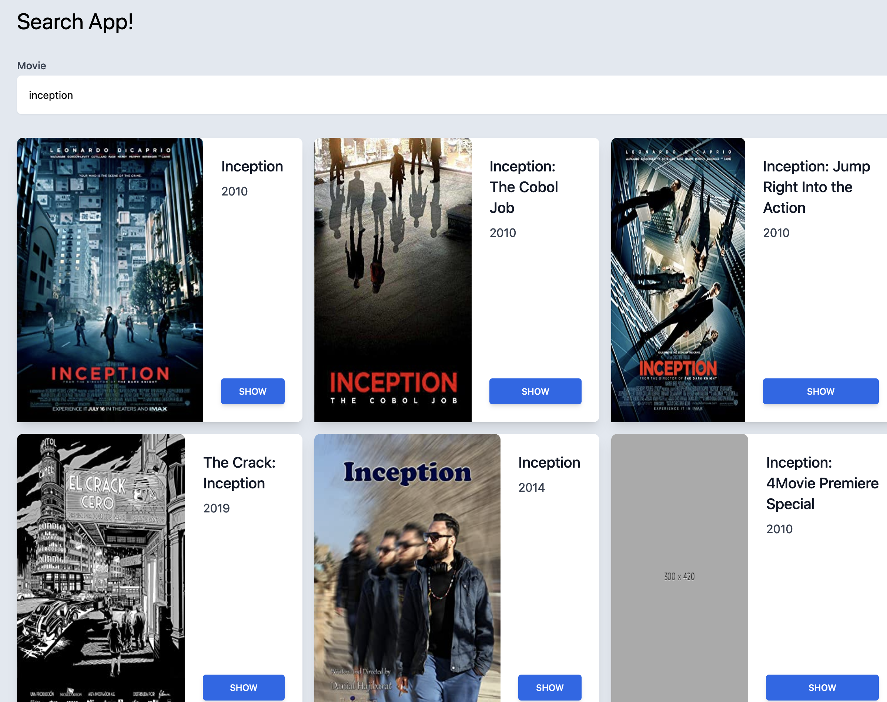

# Search App



## Setup

Make sure to install the dependencies:

```bash
# yarn
yarn install

# npm
npm install

- Add a .env file to the root
- Add NUXT_API_KEY=your_omnidb_apikey

## Development Server

Start the development server on http://localhost:3000

npm run dev
```
